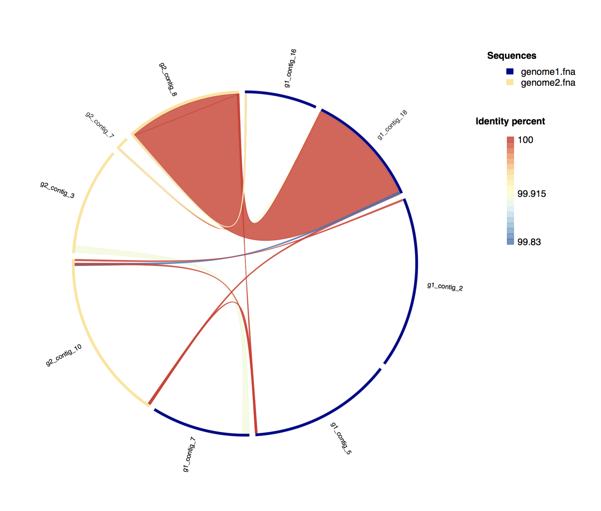
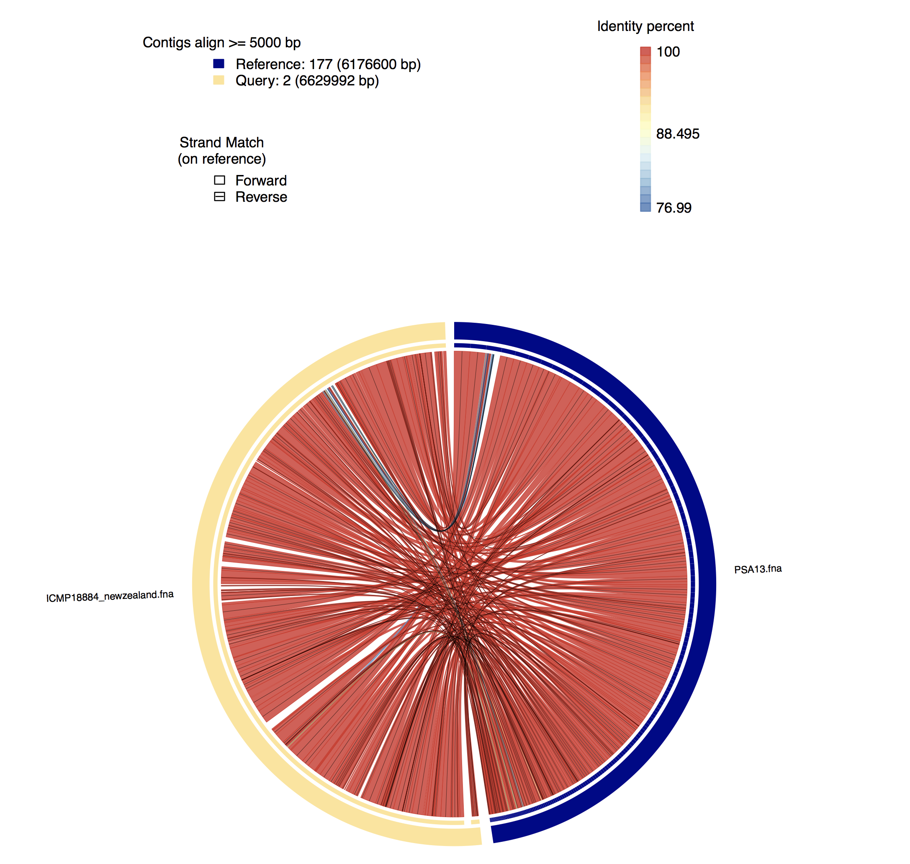

# GGisy
Genome-Genome circle synteny is a program that show the closest regions between two genomes along the all contigs using blast+. The program can cutoff (defined by user), the regions size based on the aligments length and their identities.

## Example output

------

## Requeriments

* R (tested in 3.3.1) with the following libraries:
	* omiccircos
	* RColorBrewer
	* varhandle

* Python v2.7 with biopython library
* BLAST+

## Usage

GGisy have two ways to run, the easy and complete:

easy:

	python GGisy.py -r example/genome1.fna -q example/genome2.fna
	
where:

* -r is the reference genome (in fasta format)
* -q is the query genome to be used against the reference (in fasta format).

complete:

	python GGisy.py -r example/genome1.fna -q example/genome2.fna -l 10000 -i 50 -t 8 -c False
	
where:

* -r is the reference genome.
* -q is the query genome to be used against the reference.
* -l is the aligment length cutoff to post processing.
* -i is the identity cutoff for the aligment.
* -t is the threads used for blastn
* -c is a boolean to delete the files generated or not (True by default).

### Examples:

Synteny between two genomes filtering regions <= 5000bp:

	python GGisy.py -r example/genome1.fna -q example/genome2.fna -l 10000 -i 50 -t 8 -c False
	
Synteny between two genomes conserving all files (indexes, raw blast output, parsed blast output, etc.)

	python GGisy.py -r example/genome1.fna -q example/genome2.fna -c False

Synteny between two genomes setting identity percent cutoff:

	python GGisy.py -r example/genome1.fna -q example/genome2.fna -i 90

## Trick

* You can avoid the blast work if you provide a blast output with "-b" (output format 6 is mandatory), with this parameter the program jump directly to parse it and you only have to define the cutoffs (or not).

example:
	
	python GGisy.py -r [reference] -q [query] -l 10000  -b myBlastOutput.tsv

* GGisy have an option to don't delete the files (**-c False**), if you run for the first the program you notice a file called **tmp.tsv**, this file es the blast output in format 6, and you can avoid the next run just passing this file with the **-b** option, I recommend to use this option to re-run the program with another cutoff parameters (**-l** and **-i**)
	
## Warnings

* The contigs name between the two genomes must be uniques.
* A lot of contigs will cause the graph not legible, try to filter with ``-l`` parameter, or reduce your contigs number.

## External useful tools
check for these tools to extract some useful information from your data:

* [multiGenomicContext](https://github.com/Sanrrone/multiGenomicContext): Check the genomic context of several genomes or sequence just providing the GBK files.

* [fetchMyLineage](https://github.com/Sanrrone/fetchMyLineage): Return the complete lineage of your organism just providing the genus and species names.

* [extractSeq](https://github.com/Sanrrone/extractSeq): Extract and size defined sequence from and specific contig, from and specific genome.

* [plotMyGBK](https://github.com/Sanrrone/plotMyGBK): Plot your GBK in a circular graph with COG categories.

* [pasteTaxID](https://github.com/Sanrrone/pasteTaxID): fetch the taxonomic IDs to your fastas.

* [GGisy](https://github.com/Sanrrone/GGisy): Plot synteny of two sequence (you can use two genomes), and see the identity of the matched regions.

* [getS2](https://github.com/Sanrrone/getS2): obtain the order parameter to each residue of your simulation.
